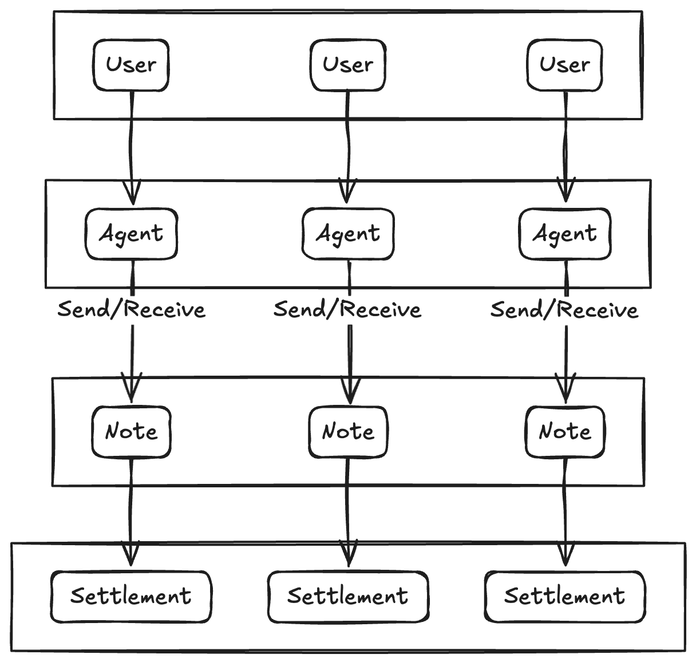

---
layout:
  title:
    visible: true
  description:
    visible: false
  tableOfContents:
    visible: true
  outline:
    visible: true
  pagination:
    visible: true
---

# Architecture

<figure><figcaption></figcaption></figure>

#### Roles

* **User：**&#x41;n external user of the system, typically interacts with the system by creating an Agent.
* **Agent**：A process running on the AO network, created by the User according to their personal objectives.
* **Note**：A standardized data model representing a financial order, implemented as a non-fungible token.
* **Settlement**：A process responsible for receiving and processing Notes submitted by Agents and fufilling their intents.
